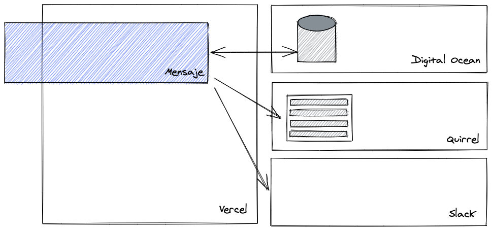

# Mensaje

A small app to do company-wide announcements over Slack. It tries to be as async as email while promoting engagement like Slack messages do.

## Motivation

> I've been thinking lately about how we communicate as a company as a whole, not just individual projects, but how the company shares updates with everyone, and I think we can do better.

> One of the challenges of being remote is that Slack is our main gathering place. If I want to communicate with everybody, I can talk in the #general channel, but I have no guarantees you will see my message. Maybe you were focusing on a task, and by the time you re-enable notifications, there are high chances you miss some important info since chat is for quick, informal communication.

> Maybe a more appropriate method to send global communications is over email. I love email because it respects everybody's time, but it lacks the ACK part Slack has with reactions and threads.

> I would love to have a method that's as async as an email but retains Slack's engagement.

_- Cherta on the first Mensaje shared in the Ingenious Slack_

Mensaje is a small app that tries to solve the problem mentioned above. It tries not to bother users with `@here` or `@channel`. Instead, it posts regular messages to Slack channels and has (or will have) a bot that reminds you about messages you might have lost.

It also provides some basic reaction features so you can ACK a message from Mensaje itself. Remember, the goal is to be as async as possible but still encourage you to react. I have more ideas to boost engagement, but if you have some, please let me know.

## Architecture



Mensaje is a simple Blitzjs app that connects to a PostgreSQL database hosted in Digital Ocean. It also uses [Quirrel](https://quirrel.dev), a Job Queueing software that's specifically made for serverless environments. Finally, it uses the Slack API for authenticating and impersonating users in Slack. This allows Mensaje to publish messages as real users.

All this runs on a Vercel serverless deployment infrastructure.

## Installation

```bash
$ git clone git@github.com:ingenious-agency/mensaje.git
$ cd mensaje
$ yarn
```

## Local development

You want to change the following environment variables in your `.env.local` file.

```
DATABASE_URL=postgresql://user@localhost:5432/mensaje
NEXT_PUBLIC_SLACK_CLIENT_ID=
SLACK_CLIENT_SECRET=
SLACK_TOKEN=
SLACK_TEAM_ID=
NEXT_PUBLIC_WEBSITE_URL=http://localhost:3000
```

All slack tokens and secrets you can get them from Slack upon app creation. If the app is already created for your team please ask the creator to add you as a collaborator.

The easiest way to get your `SLACK_TEAM_ID` is following what's described in [this Stack Overflow answer](https://stackoverflow.com/a/57246565).

```bash
$ yarn blitz prisma migrate dev --preview-feature
$ yarn start
```

In a different terminal run de dev version of Quirrel.

```bash
$ yarn quirrel
```

## Local testing

You want to copy your file `.env.local` to `.env.test.local` and change the `DATABASE_URL` accordinghly.

To kick off the tests you can `yarn test` or `yarn test:watch`. The watch version will run everything and wait for changes in your code to re run important affected ones.

## Deployment

Pushing to `main` triggers a prod deploy while pushing to any other branch doesn't trigger any preview deployment.
